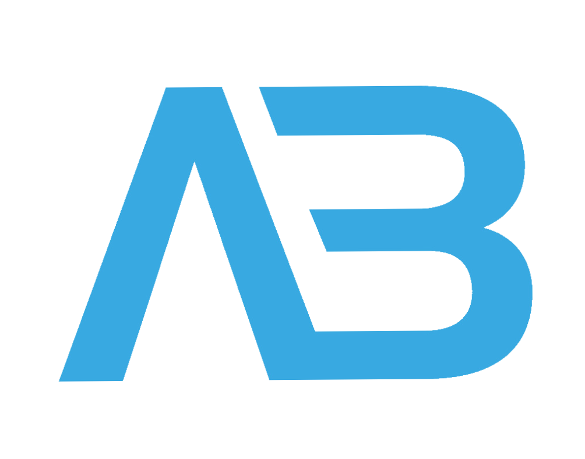

 

# Hi there, I'm Arsalan Barolia 

I recieved my Master's degree from Ryerson University, in June 2022, in Biomedical Engineering (M.&nbsp;Eng). In Decemeber 2020, I finished my Bachelor's degree in Biomedical and Electrical Engineering with a Minor in Computer Science from Carleton University. I am looking to broaden my horizon in biotechnology and electrical engineering. I have gotten the pleasure to work with various companies such as Gastops Inc. and the Ottawa Heart Institute to help develop my knowledge in the biomedical and electrical industry.

I am always on the lookout for new projects to work on and new people to collaborate with. Do check out my repositories and feel free to reach out if you would like to work on any of my existing projects or if you think that I would be a good fit in your project. You learn more about my projects at my [Portfolio](https://arsalanbarolia.com/) website.

---

### Connect with me:

&nbsp;&nbsp;

&nbsp;&nbsp;

&nbsp;&nbsp;

---

## Some of my Projects! :file_folder:

 
  

> Read and view more of my exciting [Projects](https://github.com/arsalanbarolia?tab=repositories).

---
